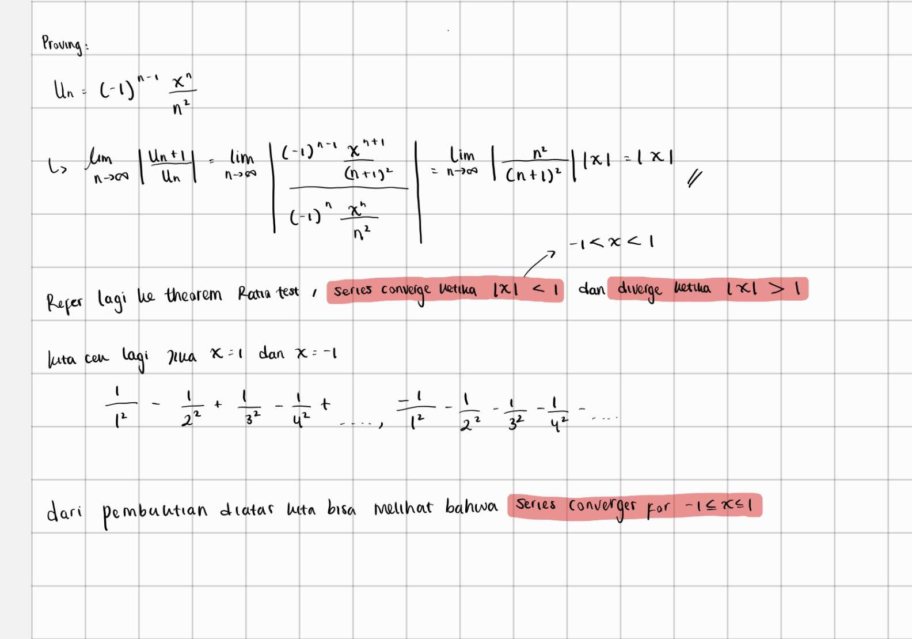

###### practicing based on past_notes.md, all these qs were taken from schaum's outline

### week 1a & 1b: sequence and series

#### week 1a

#### definition : 
##### sequence is basically a function which either converge or diverge, either having a limit to L or we can say converge to L, which for example we can write it as

\[ \sum_{n\to\infty}u_n = 1\]

#### ratio test for inf series

## sequence practice [squeeze theorem, convergency, ratio sequence's convergency]:

#### 1. investigate the convergence of : 
\[ 1 - \frac{1}{2^2} + \frac{1}{3^2} - \frac{1}{4^2} + \frac{1}{5^2} \]

refering to theorem 1.2, as we can see *p* is 2 which is greater than 1, we can conclude that the sequence above does converge.

#### 2. Prove that this series converges for \(-1 \leq x \leq 1\)

the formula for the *n*th term is 

\[u_n = (-1)^{n - 1} \frac{x^n}{n^2}\]

