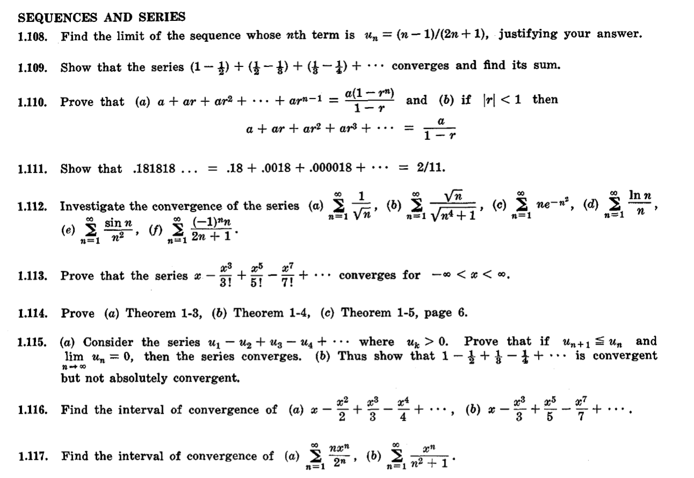
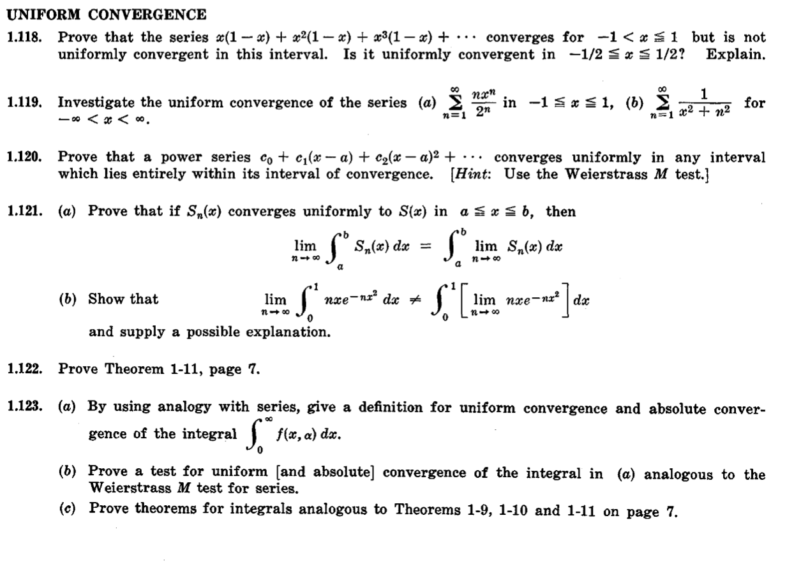
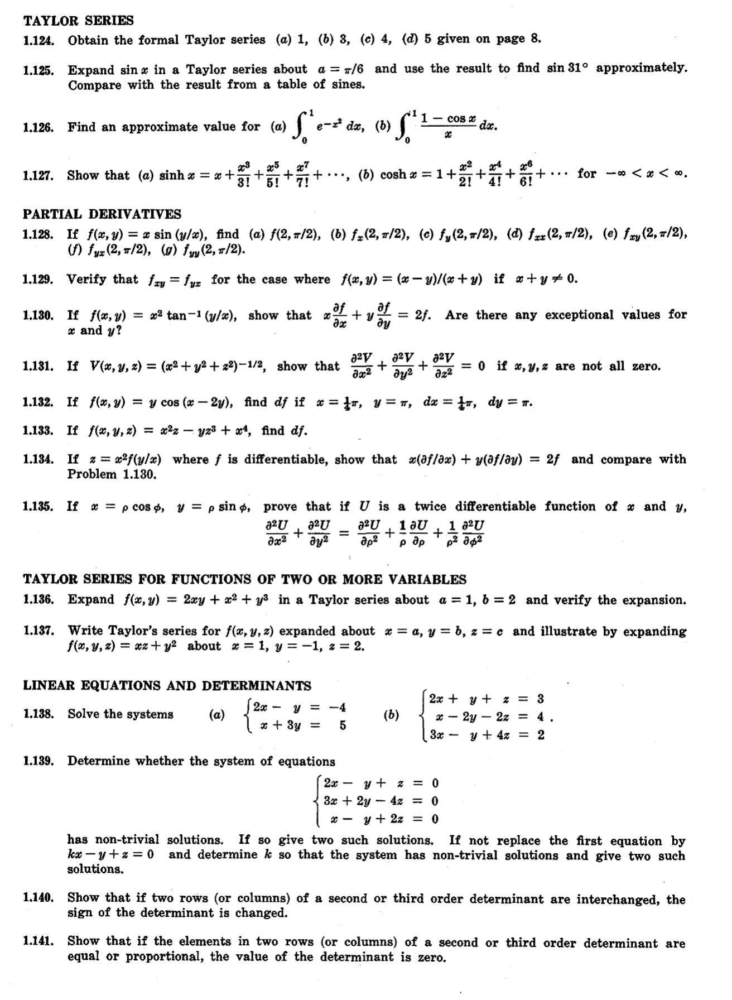

#### Material : [Convergency Test, ODE, Taylor Series]
#### 10 questions [Medium Difficulty]
#### deadline 1/22/25 [23:59], penalty : +5 questions next day

- [ ] 1.112 [seq & series],
- [ ] 1.121 [uniform convergence],
- [ ] 1.127 [taylor series],
- [ ] 1.128 [partial deriv],
- [ ] 1.136 [taylor series for func of two or more var],
- [ ] 1.138 [linear eq & determinants].
