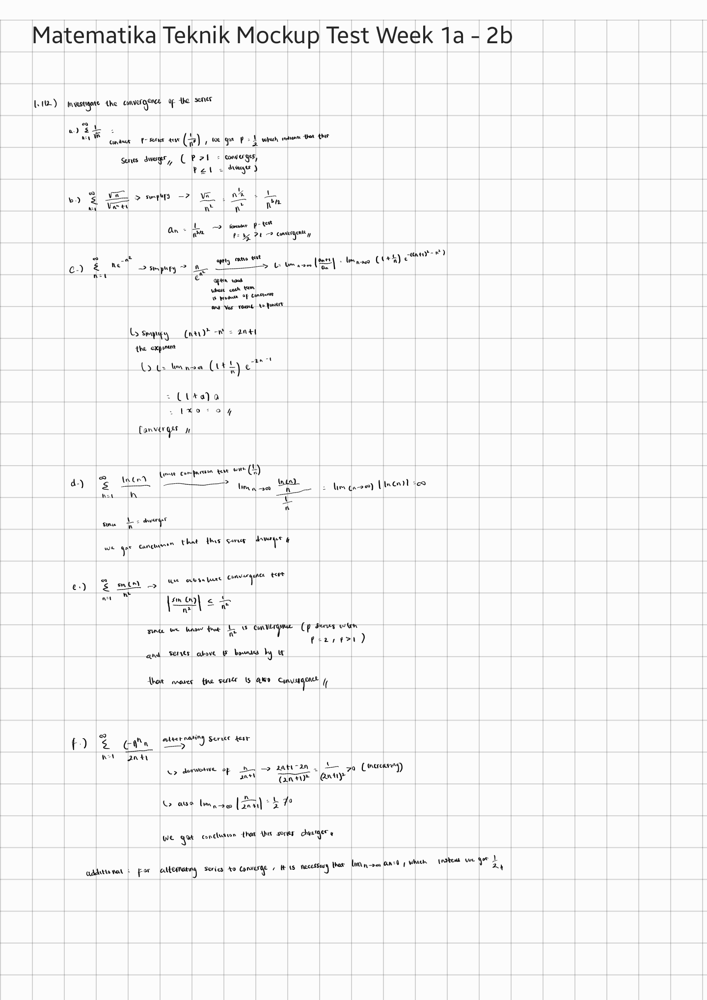

#### Material : [Convergency Test, ODE, Taylor Series]
#### 6 questions [Medium Difficulty]
#### 30 Jan 2025, Penalty : +10 questions next day

- [x] 1.112 [seq & series],
- [ ] 1.121 [uniform convergence],
- [ ] 1.127 [taylor series],
- [ ] 1.128 [partial deriv],
- [ ] 1.136 [taylor series for func of two or more var],
- [ ] 1.138 [linear eq & determinants].

answer 

